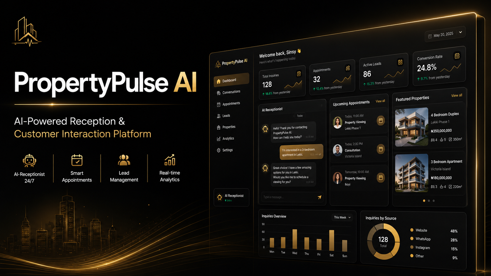

<p align="center">
  
</p>
 
 
 # 🤖 PropertyPulse AI

> An AI-powered receptionist and customer interaction platform designed to automate conversations, streamline inquiry management, and deliver intelligent customer experiences across modern web applications.

 <p align="center">


</p>

---

# 🔒 Source Code Availability

The production source code for PropertyPulse AI is maintained in a **private repository** due to proprietary implementation details and ongoing commercial development.

This public repository serves as a technical case study highlighting the project's architecture, engineering decisions, and product capabilities while respecting confidentiality.

---

# 📸 Product Preview

 
---

 ## 🚀 Overview

**PropertyPulse AI** is an AI-powered receptionist and customer engagement platform designed to help businesses automate customer interactions, capture qualified leads, schedule appointments, and deliver fast, intelligent responses through conversational AI.

Built with a modern React and TypeScript architecture, the platform combines AI-driven conversations, secure authentication, real-time communication workflows, and responsive user experiences to streamline customer engagement across desktop and mobile devices.

> **Note:** This repository is a public case study. The production source code is maintained in a private repository due to proprietary implementation details and ongoing product development.

---

# 🎯 The Problem

Many businesses lose potential customers because inquiries are answered too slowly or require constant manual effort.

Traditional communication channels often struggle with:

- Delayed customer responses
- High support workload
- Inconsistent communication
- Poor lead tracking
- Limited availability outside business hours

---

# 💡 The Solution

PropertyPulse AI addresses these challenges through an AI-powered conversational platform capable of:

- Answering customer questions instantly
- Managing appointment requests
- Guiding users through property inquiries
- Supporting business workflows with AI-driven conversations
- Delivering a responsive experience across all devices

---

# ✨ Key Features

- 🤖 AI-powered conversational assistant
- 💬 Real-time customer interaction
- 🔐 Secure authentication
- 📱 Fully responsive interface
- ⚡ Intelligent response workflows
- 🧩 Modular component architecture
- 🔄 API-driven communication
- 📊 Scalable dashboard experience

---

# 🛠 Tech Stack

## Frontend

- React
- TypeScript
- Tailwind CSS
- Context API
- Vite

## Backend & Services

- Firebase
- OpenAI API
- REST APIs

## Development Tools

- Git
- GitHub
- Postman

---

# 🏗 Architecture

```
Customer

      │

      ▼

React + TypeScript

      │

Conversation Engine

      │

REST API Layer

      │

OpenAI API

      │

Firebase Services
```

The platform follows a modular architecture designed for scalability, maintainability, and high-performance conversational workflows.

---

# ⚙️ Engineering Highlights

The project emphasizes modern frontend engineering through:

- Reusable component architecture
- Scalable state management
- Responsive UI design
- AI-assisted interaction flows
- Asynchronous API communication
- Clean separation of concerns
- Performance-focused rendering optimization

---

# 🚧 Technical Challenges

One of the most interesting engineering challenges was maintaining smooth AI conversations while ensuring the interface remained responsive and predictable during asynchronous API requests.

This was addressed through:

- Optimized component rendering
- Modular conversation architecture
- Efficient asynchronous request handling
- Clean state management
- Responsive UI updates

---

# 📈 Performance & User Experience

Key improvements included:

- Faster conversational response handling
- Reduced unnecessary component re-renders
- Improved mobile responsiveness
- Scalable frontend architecture
- Smooth conversational workflows
- Enhanced user navigation

---

# 🎯 Project Impact

PropertyPulse AI demonstrates how conversational AI can transform customer communication by reducing manual workload and improving response times.

Beyond the technical implementation, the project strengthened my experience in building production-oriented AI interfaces, scalable React applications, and responsive user experiences.

---

# 📚 What I Learned

This project deepened my understanding of:

- AI-assisted frontend development
- Prompt-driven application workflows
- Scalable React architecture
- API integration patterns
- Responsive conversational UI
- Performance optimization
- Building production-ready SaaS applications

---

# 🔮 Future Enhancements

- Voice AI integration
- Multi-language support
- CRM integrations
- Calendar synchronization
- AI analytics dashboard
- Team collaboration tools
- WhatsApp integration
- Advanced customer insights

---

# 👨‍💻 About This Case Study

This repository exists to showcase the engineering approach behind PropertyPulse AI while protecting proprietary business logic and implementation details.

If you'd like to discuss the project or learn more about my work, feel free to connect.

---

# 🤝 Connect With Me

**Ismail Aminu Said**

🌐 Portfolio  
https://ismailaminusaid.netlify.app

💼 LinkedIn  
https://linkedin.com/in/sinsy-dev

💻 GitHub  
https://github.com/Sinsydev

📧 Email  
ismailaminusaid1234@gmail.com

---

<div align="center">

### ⭐ Thanks for visiting!

**Building AI-powered products that solve real-world problems.**

</div>
