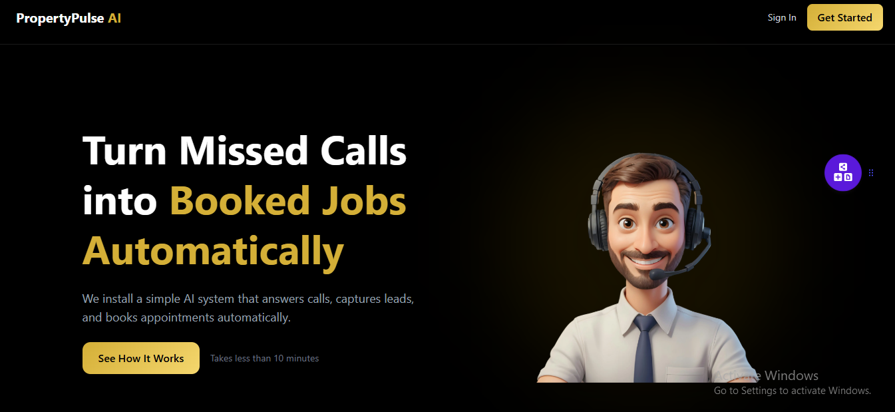
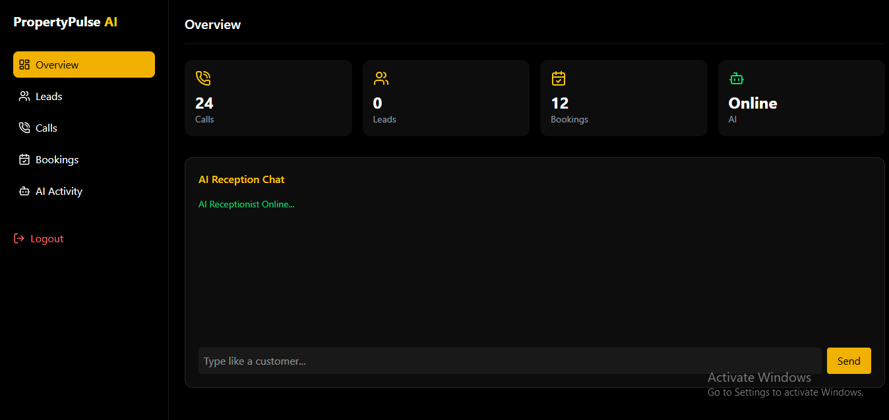

<p align="center">
  
</p>
 
 
 # 🤖 PropertyPulse AI

> An AI-powered receptionist and customer interaction platform designed to automate conversations, streamline inquiry management, and deliver intelligent customer experiences across modern web applications.

 <p align="center">


</p>

---

# 🔒 Source Code Availability

The production source code for PropertyPulse AI is maintained in a **private repository** due to proprietary implementation details and ongoing commercial development.

This public repository serves as a technical case study highlighting the project's architecture, engineering decisions, and product capabilities while respecting confidentiality.


 ## 🚀 Overview

**PropertyPulse AI** is an AI-powered receptionist and customer engagement platform designed to help businesses automate customer interactions, capture qualified leads, schedule appointments, and deliver fast, intelligent responses through conversational AI.

Built with a modern React and TypeScript architecture, the platform combines AI-driven conversations, secure authentication, real-time communication workflows, and responsive user experiences to streamline customer engagement across desktop and mobile devices.

> **Note:** This repository is a public case study. The production source code is maintained in a private repository due to proprietary implementation details and ongoing product development.

---
## 🚨 The Problem

Businesses frequently lose potential customers because they cannot respond instantly to inquiries outside business hours or during periods of high demand. Manual appointment scheduling, delayed responses, and fragmented communication often result in missed opportunities and reduced customer satisfaction.

Traditional customer support workflows also require significant human effort, making it difficult for growing businesses to scale while maintaining consistent service quality.

---

## 💡 The Solution

PropertyPulse AI provides an AI-powered virtual receptionist capable of engaging customers in natural conversations, qualifying leads, answering common questions, and assisting with appointment scheduling.

Built using React, TypeScript, Firebase, OpenAI, and Twilio, the platform demonstrates how conversational AI can automate customer engagement while remaining scalable, secure, and responsive across devices.

The long-term vision extends beyond an AI receptionist to an intelligent customer engagement platform capable of supporting voice interactions, CRM integrations, predictive analytics, and multi-channel communication.
 

---

 

---
 ## ✨ Core Features

### 🤖 AI Assistant

- Natural language conversations
- AI-powered customer assistance
- Intelligent lead qualification
- Automated inquiry handling

---

### 📅 Customer Management

- Appointment scheduling
- Lead capture
- Customer inquiry management
- Conversation history

---

### 🔐 Security

- Firebase Authentication
- Protected routes
- Secure cloud storage
- Environment variable configuration

---

### ⚙️ Engineering

- Component-based React architecture
- Type-safe TypeScript development
- Modular project organization
- Responsive UI
- REST API integrations
- Context API state management

---

### 🚀 Future AI Vision

- Voice AI
- CRM automation
- Predictive lead scoring
- AI analytics
- WhatsApp Business
- Calendar intelligence

---

 ## 🛠 Tech Stack

### Frontend
- React
- TypeScript
- Tailwind CSS
- Context API

### Backend & Services
- Firebase Authentication
- Cloud Firestore
- Twilio
- OpenAI API
- REST APIs

### Development Tools
- Vite
- Git & GitHub
- Postman

---

# 🏗 Architecture

```
                    Customer

                      │

                      ▼

          React + TypeScript Frontend

                      │

         Context API State Management

                      │

      Conversation & Business Logic Layer

          ┌──────────────┬──────────────┐

          ▼              ▼

     OpenAI API      Twilio Services

          │              │

          └───────┬──────┘

                  ▼

        Firebase Cloud Platform

     Authentication • Firestore • Storage
```

The platform follows a modular architecture designed for scalability, maintainability, and high-performance conversational workflows.

---

## 🏛️ Design Principles

PropertyPulse AI was designed around the following principles:

• Scalability
• Maintainability
• Performance
• User Experience
• Security
• Modularity
• AI-first Design

---

  <p align="center">
  
  
</p>

---

# 🚧 Technical Challenges

One of the most interesting engineering challenges was maintaining smooth AI conversations while ensuring the interface remained responsive and predictable during asynchronous API requests.

This was addressed through:

- Optimized component rendering
- Modular conversation architecture
- Efficient asynchronous request handling
- Clean state management
- Responsive UI updates

---

# 📈 Performance & User Experience

Key improvements included:

- Faster conversational response handling
- Reduced unnecessary component re-renders
- Improved mobile responsiveness
- Scalable frontend architecture
- Smooth conversational workflows
- Enhanced user navigation

---

# 🎯 Project Impact

PropertyPulse AI demonstrates how conversational AI can transform customer communication by reducing manual workload and improving response times.

Beyond the technical implementation, the project strengthened my experience in building production-oriented AI interfaces, scalable React applications, and responsive user experiences.

---

# 📚 What I Learned

This project deepened my understanding of:

- AI-assisted frontend development
- Prompt-driven application workflows
- Scalable React architecture
- API integration patterns
- Responsive conversational UI
- Performance optimization
- Building production-ready SaaS applications

---

# 🔮 Future Enhancements

- Voice AI integration
- Multi-language support
- CRM integrations
- Calendar synchronization
- AI analytics dashboard
- Team collaboration tools
- WhatsApp integration
- Advanced customer insights

---

# 👨‍💻 About This Case Study

This repository exists to showcase the engineering approach behind PropertyPulse AI while protecting proprietary business logic and implementation details.

If you'd like to discuss the project or learn more about my work, feel free to connect.

---

# 🤝 Connect With Me

**Ismail Aminu Said**

🌐 Portfolio  
https://ismailaminusaid.netlify.app

💼 LinkedIn  
https://linkedin.com/in/sinsy-dev

💻 GitHub  
https://github.com/Sinsydev

📧 Email  
ismailaminusaid1234@gmail.com

---

<div align="center">

### ⭐ Thanks for visiting!

**Building AI-powered products that solve real-world problems.**

</div>
